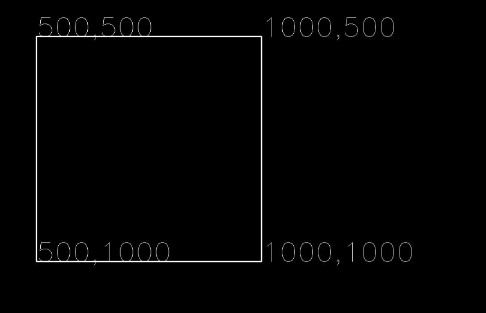
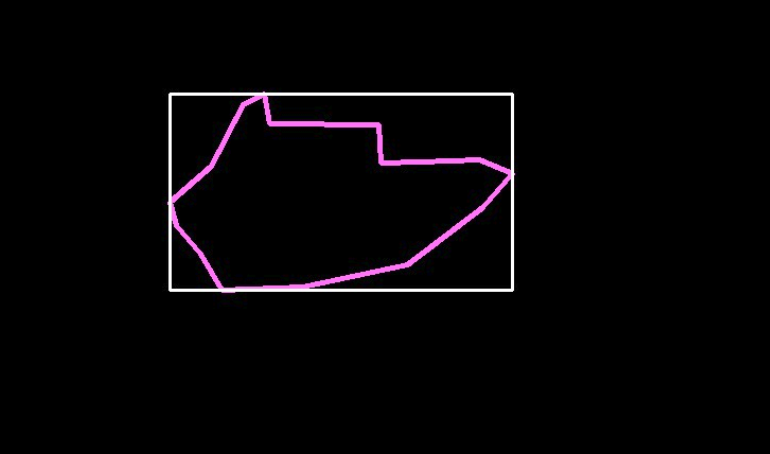

# Opencv shape Drawing Solution
### Draw rectangle with 4 co-ordinates visialization
```py
import numpy as np
import cv2
import matplotlib.pyplot as plt
img = np.zeros((2000, 2000, 3), dtype = "uint8")
x = 500
y = 500
w = 1000
h = 1000
x_y_co= str(x)+","+str(y)
x2_y2 = str(w)+","+str(y)
x3_y3= str(x)+","+str(h)
x4_x4 = str(w)+","+str(h)

img_mod = cv2.rectangle(img, (x,y), (w,h), (255,255,255), 2)

cv2.putText(img,x_y_co, (x,y), cv2.FONT_HERSHEY_SIMPLEX, 2, (255,255,255))
cv2.putText(img,x2_y2, (w,y), cv2.FONT_HERSHEY_SIMPLEX, 2, (255,255,255))
cv2.putText(img,x3_y3, (x,h), cv2.FONT_HERSHEY_SIMPLEX, 2, (255,255,255))
cv2.putText(img,x4_x4, (w,h), cv2.FONT_HERSHEY_SIMPLEX, 2, (255,255,255))
cv2.imwrite("shape.jpg",img_mod)
plt.imshow(img_mod)
plt.show()
```
Output Result:



### Opencv Polygon to Rectangle 

Draw image shape polygon to Rectanlge using opencv.

```py
import numpy as np
import cv2
import matplotlib.pyplot as plt

 
img = np.zeros((3400, 3400, 3), dtype = "uint8")

x = [1724, 1694, 1655, 1661, 1684, 1704, 1780, 1879, 1950, 1978, 1947, 1891, 1854, 1852, 1749, 1744]
y = [2863, 2921, 2955, 2977, 3004, 3038, 3035, 3014, 2960, 2928, 2915, 2917, 2918, 2882, 2881, 2853]

new_x = min(x)
new_y = min(y)
w = max(x)
h = max(y)

data = [[i,j] for i,j in zip(x,y)]
print(data)
penta = np.array([data], np.int32)
 
img_mod = cv2.polylines(img, [penta], True, (255,120,255),3)
img_mod = cv2.rectangle(img, (new_x,new_y), (w,h), (255,255,255), 2) 
# cv2.imshow('Shapes', img_mod)
cv2.imwrite("shape.jpg",img_mod)
plt.imshow(img_mod)
plt.show()
```

Here x and y is the polygon (x,y)coordinate.To draw rectanlge we need (x,y) and (w,h) coordinate.So we take min x and min y for rectange (x,y) and max x,y for rectange (w,h).

Output Result:


# Roi to polygon Draw:
```py 
import numpy as np
import cv2
import matplotlib.pyplot as plt
img = cv2.imread("Scan_20191211 (3).jpg")
p_img = img.copy()
# img = np.zeros((1000, 1000, 3), dtype = "uint8")
x = 356
y = 475
w = x+301
h = y+72

x1,y1,x2,y2,x3,y3,x4,y4 = x,y,w,y,w,h,x,h

poly_x = [x1,x2,x3,x4]
poly_y = [y1,y2,y3,y4]

data = [[i,j] for i,j in zip(poly_x,poly_y)]
penta = np.array([data], np.int32)

# x_y_co= "x:"+str(x)+",y:"+str(y)
# x2_y2 = "w"+str(w)+",y:"+str(y)
# x3_y3= "x"+str(x)+",h:"+str(h)
# x4_x4 = "w"+str(w)+",h:"+str(h)

# img_mod = cv2.rectangle(img, (x,y), (w,h), (0,255,0), 2)
img_poly = cv2.polylines(p_img, [penta], True, (255,120,255),3)

# cv2.putText(img,x_y_co, (x,y), cv2.FONT_HERSHEY_SIMPLEX, 0.5, (0,255,0))
# cv2.putText(img,x2_y2, (w,y), cv2.FONT_HERSHEY_SIMPLEX, 0.5, (0,255,0))
# cv2.putText(img,x3_y3, (x,h), cv2.FONT_HERSHEY_SIMPLEX, 0.5, (0,255,0))
# cv2.putText(img,x4_x4, (w,h), cv2.FONT_HERSHEY_SIMPLEX, 0.5, (0,255,0))

# cv2.imwrite("shape.jpg",img_mod)
cv2.imwrite("img_poly.jpg",img_poly)
plt.imshow(img_poly)
plt.show()
```

